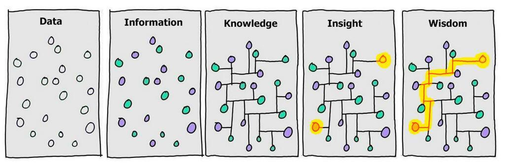

# Hi there 👋

I am (Andrew) Zhanke Zhou, a Ph.D. student at [TMLR group](https://bhanml.github.io/group.html) of Hong Kong Baptist University, advised by [Prof. Bo Han](https://bhanml.github.io/) and working with [Prof. Jiangchao Yao](https://sunarker.github.io/).
Currently, I am a visiting student at [STAIR lab](https://stair.cs.stanford.edu/team/) of Stanford University, working with [Prof. Sanmi Koyejo](https://cs.stanford.edu/~sanmi/).
Prior to that, I was a visiting student at [LARS group](https://lars-group.github.io/pages/group.html) of Tsinghua University, working with [Prof. Quanming Yao](https://lars-group.github.io/) and [Prof. Yongqi Zhang](https://yzhangee.github.io/).

My research focuses on **trustworthy machine reasoning with foundation models** (LLMs, VLMs) to solve **complex problems** such as mathematics and coding, as well as to accelerate scientific discovery and application in fields like biology, chemistry, and healthcare. I believe that **reasoning** is the essential pathway to achieving AGI. Trustworthy machine reasoning encompasses properties such as reasoning power, robustness, safety, and explainability. 
My work involves developing methodologies, benchmarks, and theoretical foundations to advance these areas:
- Developing advanced trustworthy reasoning systems (incorporating RL and tool learning) [[AR-Bench]](https://arxiv.org/pdf/2506.08295) [[Landscape of thoughts]](https://arxiv.org/pdf/2503.22165) [[ECON]](https://arxiv.org/pdf/2506.08292)
- Comprehensive evaluation and benchmarking of foundation model trustworthiness [[NoRa]](https://arxiv.org/pdf/2410.23856) [[DeepInception]](https://arxiv.org/pdf/2311.03191) [[G-effect]](https://arxiv.org/pdf/2502.19301) [[NTTA]](https://arxiv.org/pdf/2502.14604) [[EOE]](https://arxiv.org/pdf/2406.00806)
- Trustworthy machine learning and reasoning on (knowledge) graphs [[GRA]](https://arxiv.org/pdf/2306.09104) [[RGIB]](https://arxiv.org/pdf/2311.01196) [[Subgraph]](https://arxiv.org/pdf/2403.10231) [[Neural Atoms]](https://arxiv.org/pdf/2311.01276) [[AdaProp]](https://arxiv.org/pdf/2205.15319) [[KGTuner]](https://arxiv.org/pdf/2205.02460)

I am leading the reasoning team in the TMLR group, and fortunately working with several talented researchers. **We welcome potential collaborations in various forms, including visiting PhD students, research assistants, and undergraduate trainees.** *Please feel free to [email me](mailto:cszkzhou@comp.hkbu.edu.hk) and [Prof. Bo Han](mailto:bhanml@comp.hkbu.edu.hk) to discuss collaboration opportunities.*
We are also organizing the [TMLR Young Scientist Seminars](https://tmlr-group.github.io/seminars/TMLR_YSS.html) and actively seeking researchers interested in sharing their work. If you would like to give a talk, we encourage you to reach out to us.

E-mail: cszkzhou [at] comp.hkbu.edu.hk / zhanke [at] cs.stanford.edu / andrewzhou924@gmail.com

<!-- For more information, visit my [personal website](https://andrewzhou924.github.io/). -->
<!--  -->
<!--  -->
<!-- *Pain is inevitable. Suffering is optional. --- Haruki Murakami* -->
